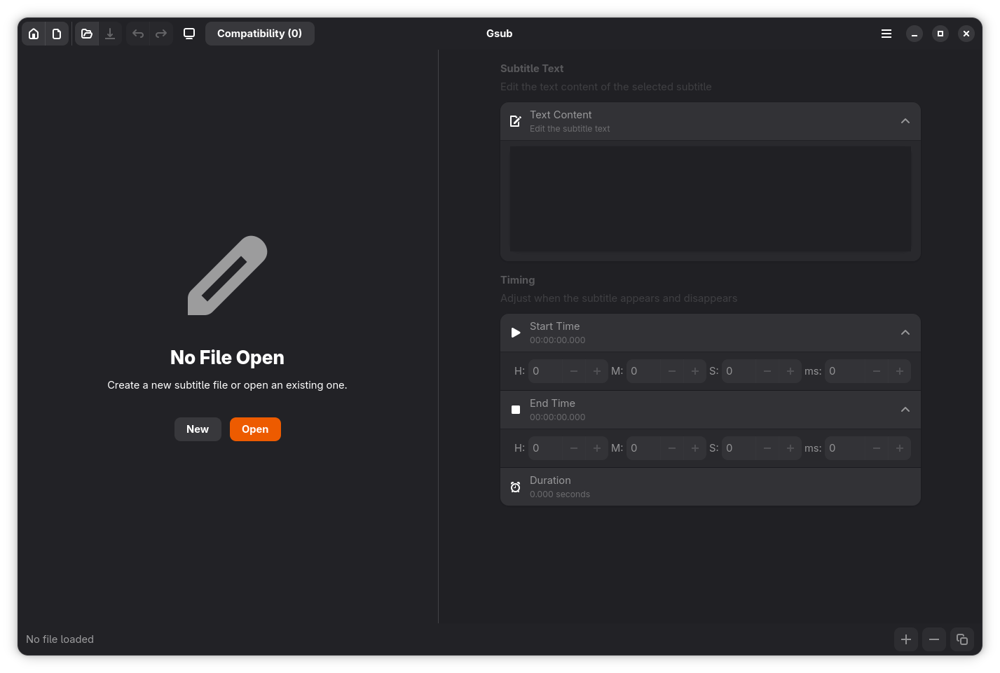
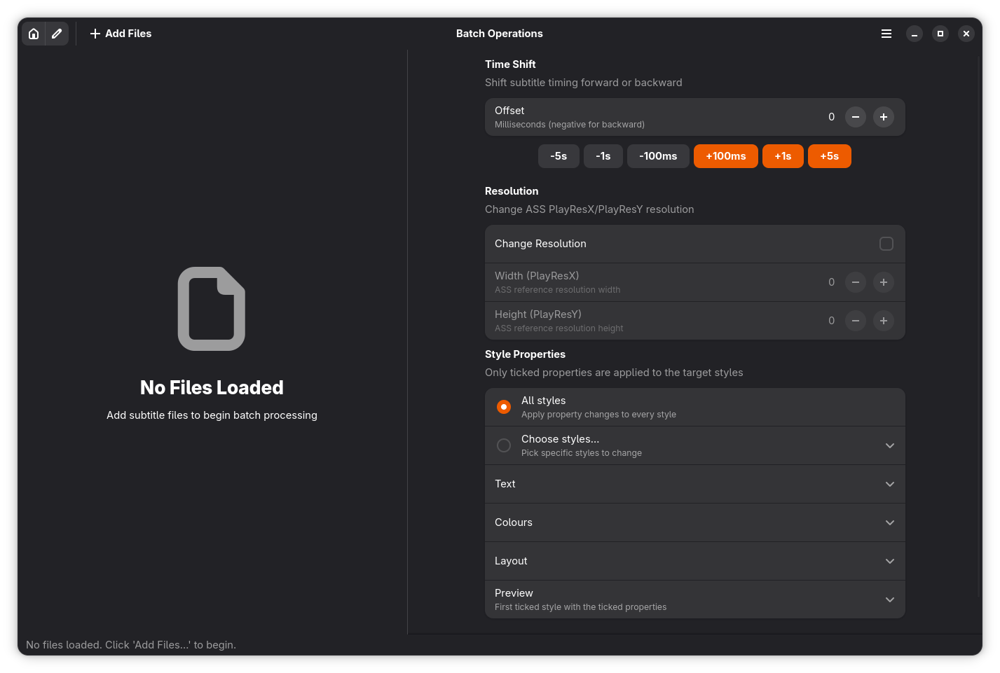
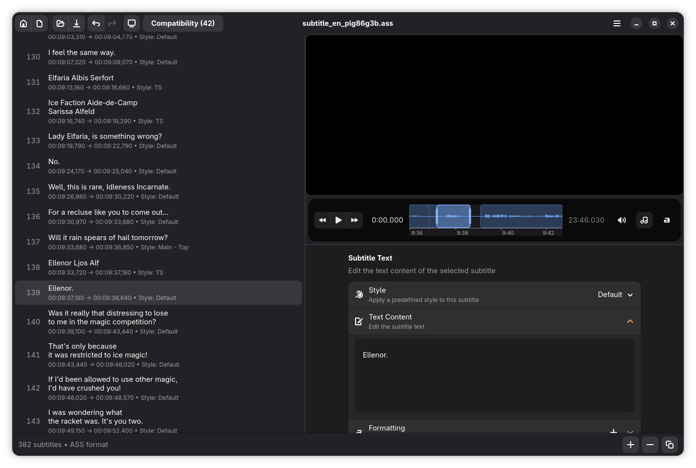
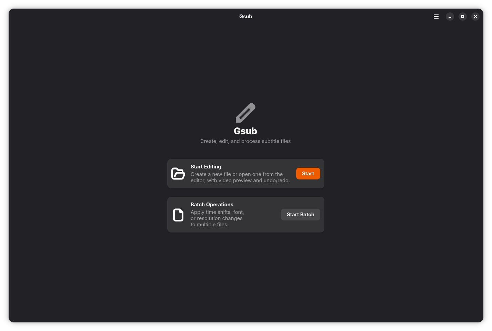

# Gsub

A modern subtitle editor for the GNOME desktop, built with GTK 4 and
libadwaita. Gsub makes it easy to edit, transform, and proofread SRT and
ASS/SSA subtitle files — with a libmpv video preview, a precise timeline
with an optional audio waveform, and a visual editor for ASS override
tags.

> **Note:** This project was mainly vibe-coded. Contributions, bug reports, and
> feedback are very welcome as the code matures.

## Screenshots

**The editor with live video preview** — subtitle list on the left, your
subtitles rendered over the video by libmpv, and the editing panel below:


**Visual override-tag editing** — the list shows clean, readable text while
the leading `{…}` tag block is exposed in the Formatting expander as proper
controls (font, size, colours, position, …):


**The timeline** — precise seeking with an optional audio waveform (off by
default); subtitle regions are drawn on the timeline and can be dragged to
retime a line or stretched by their handles to change its duration:


**The home screen**:


## Features

### Editing
- **SRT & ASS/SSA support** — full parsing and serialization for both formats,
  including byte-exact round-trip fidelity for ASS override tags and section
  metadata.
- **Undo/redo with feedback** — every edit goes through a command stack; a
  toast names what was undone or redone.
- **Visual ASS override-tag editor** — the subtitle list and text editor show
  clean text while `{…}` blocks are edited through proper widgets: font, size,
  bold/italic/underline/strikeout, all five colour tags, `\pos`, blur, border
  and shadow. Complex tags (`\t`, `\clip`, …) stay editable as raw text.
- **Semantic style inputs** — Alignment as a 3×3 position grid, BorderStyle
  and Encoding as named dropdowns (with a custom-value fallback), in both the
  styles dialog and the batch editor.
- **Batch operations** — shift timings, resize fonts per style, and bulk-apply
  styles across one or many files at once.
- **Subtitle extraction & conversion** — pull subtitle tracks out of video
  files (via PyAV, with an ffprobe/ffmpeg fallback) and convert between
  formats.
- **Encoding detection** — best-effort auto-detection of non-UTF-8 subtitle
  encodings (cp1252, Shift-JIS, …) with a stdlib fallback.
- **Compatibility checks** — a panel flags common ASS problems (invisible
  text, renderer-dependent tags, `\pos` out of bounds, …) with one-click
  fixes.

### Video & timing
- **Video preview** — a libmpv-powered player renders your subtitles over the
  video so you can check timing and appearance live.
- **Precise timeline** — click or drag to seek exactly; arrow keys nudge by
  0.1 s / 5 s; `,` and `.` step one frame; Ctrl+J plays from the selected
  line; Ctrl+scroll zooms down to milliseconds.
- **Optional waveform** — toggle an audio wave under the timeline (off by
  default); peaks are decoded from the selected audio track in the background
  and cached for instant reopening.
- **Retiming on the timeline** — drag a subtitle's region to move it, or grab
  its edge handles to change its start/end; every drag is one undoable
  command.
- **Playback sync** — while the video plays, the subtitle list highlights and
  scrolls to the current line without stealing your selection.

### Integration
- **Open videos from the file manager** — Gsub registers as a handler for
  common video types; opening one launches straight into the editor and
  offers to extract embedded subtitle tracks.
- **Unified track selection** — one dialog picks audio and subtitle tracks
  and can extract a subtitle track for editing.
- **Keyboard-first** — a complete shortcuts dialog (Ctrl+?) driven by a
  single shortcut table shared with the actual key bindings.

## Dependencies

### System libraries and tools

- `libadwaita-1` >= 1.8
- `gtk4` >= 4.14
- `glib-2.0`
- `blueprint-compiler` (compiles the `.blp` UI templates)
- `glib-compile-resources` (bundles the UI into a gresource)
- `libmpv` (powers video playback and subtitle rendering)

### Python packages

Installed automatically from `setup.py`/`requirements-dev.txt`:

- `PyGObject` >= 3.42
- `pycairo` >= 1.20
- `python-mpv` >= 1.0 (runtime binding for libmpv)
- `PyOpenGL` >= 3.1
- `av` >= 11.0 (bundles FFmpeg for extraction; no system FFmpeg needed)
- `charset-normalizer` >= 3.0

## Installation

### Option A — From source with meson (system install)

```bash
meson setup build
meson compile -C build
meson install -C build
```

This installs the app, its icon, the desktop file, and refreshes the icon and
desktop caches.

### Option B — Editable install with pip / Makefile

```bash
pip install -e .
make build-resources      # compiles .blp -> .ui and bundles the gresource
make install              # installs desktop file + icon under ~/.local
```

Or simply run `make install`, which performs both steps (plus the desktop/icon
install). After installation, launch **Gsub** from the GNOME app grid or run:

```bash
gsub
```

You can also open files directly: `gsub path/to/subtitle.srt` or
`gsub path/to/video.mkv` (or via **Open With** in your file manager).

## Usage

1. Launch Gsub, press **Start**, and create a new file or open an existing one
   from the editor (or pass a file path as an argument).
2. Edit entries, adjust timings, and tweak ASS styles in the editor panel.
3. Load a video to preview subtitles live, time lines precisely on the
   timeline, and optionally extract embedded subtitle tracks for editing.
4. Use the batch operations panel for bulk changes across styles or files.
5. Save your work — every change is undoable/redoable.

## Development

Clone the repository and install the development dependencies:

```bash
pip install -r requirements-dev.txt
```

Build the UI resources (needed to run the app from the source tree):

```bash
make build-resources
```

Run the application from the source tree:

```bash
python -m subtitle_editor.main
```

### Running the tests

The test suite uses `pytest` and covers the parsers, models, command stack,
converters, widgets, and the main window (over 1000 tests).

```bash
pip install -r requirements-dev.txt
pytest
```

Generate an HTML coverage report with:

```bash
pytest --cov=subtitle_editor --cov-report=html
xdg-open htmlcov/index.html
```

See [`tests/README.md`](tests/README.md) for details on the test layout,
markers, and fixtures.

## Project structure

```
gsub/
├── data/                 # desktop file, icon, gresource manifest, blueprints
│   └── blueprints/       # GTK Blueprint UI templates (.blp)
├── screenshots/          # screenshots used in this README
├── subtitle_editor/      # application source
│   ├── commands/         # undo/redo command pattern
│   ├── converters/       # format conversion
│   ├── extractors/       # subtitle extraction from video
│   ├── models/           # data models (TimeCode, SubtitleEntry, …)
│   ├── parsers/          # SRT / ASS parsers + encoding detection
│   └── widgets/          # GTK widget glue
├── tests/                # pytest suite
├── setup.py              # pip/setuptools build
└── meson.build           # system (meson) build
```

## License

Gsub is free software, released under the **GNU General Public License v3.0 or
later**. See the [`LICENSE`](LICENSE) file for the full text.
